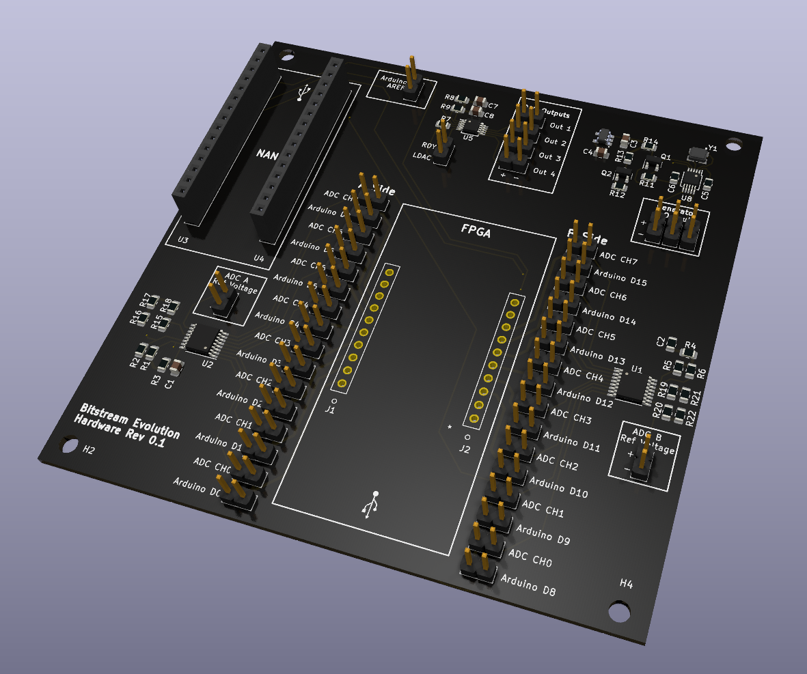
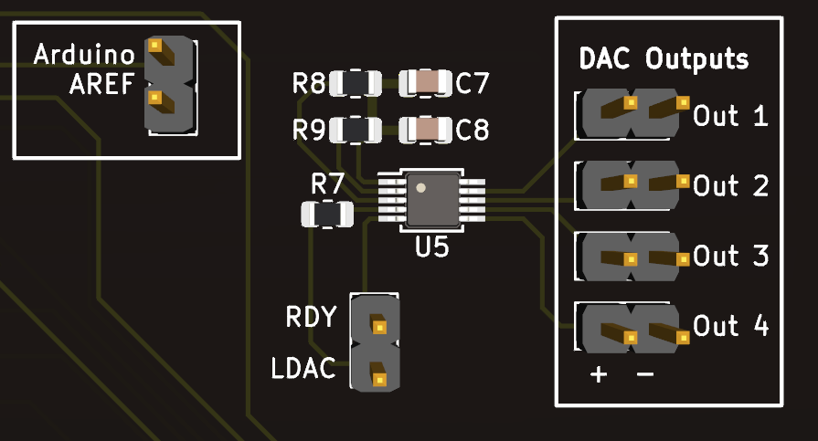
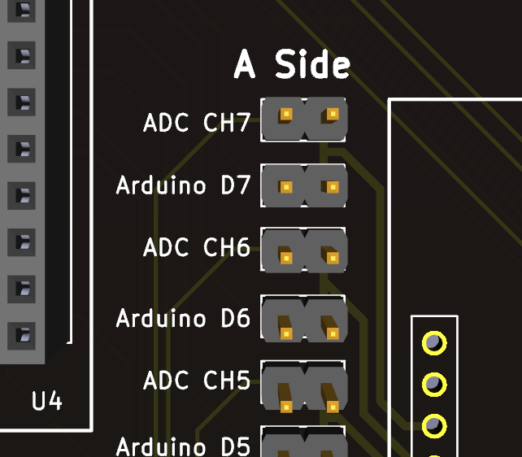
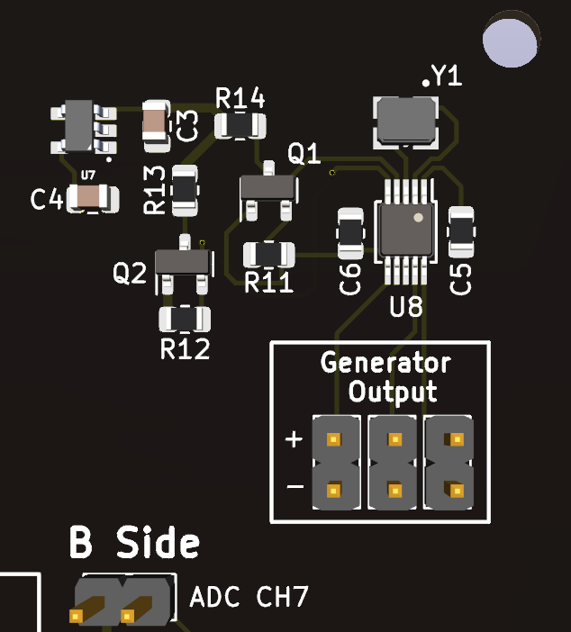
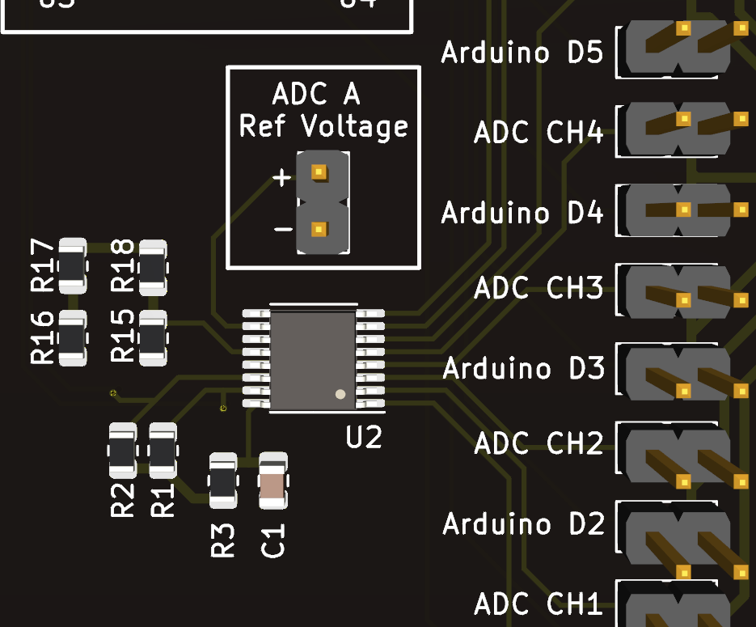

Bitstream Evolution Dev Board
===
###### Created by Logan Manthey ( [@manthelt](https://github.com/manthelt) )
---

## Introduction

This dev board is an extension of the evolvable hardware opensource project (https://evolvablehardware.org/). It was created to expand and bring new features to the evolvable hardware ecosystem while still maintaining it’s accessibility. To make the board accessible KiCAD was chosen for the CAD software given it’s open source and free nature. To find Gerber files for printing take a look at the release section. 

## Features

* **Multi Channel ADC** 
Supporting two 8 channel **NAME OF ADC** ADCs this dev board can record up to 16 channels at up to **XX** samples per second

 * **Multiple DACs**
To provide support for future expandability multiple DACs were included. The primary use case of these DACs is for setting the reference voltage for the the interrupt input on the ardunio but can be used for other various purposes such as adjusting a voltage offset for the waveform or for setting the reference voltage for the ADCs 

* **Waveform Generation**
This Dev Kit also includes a programmable waveform generator. The primary uses of this are for both sanity checking instrumentation and for evolving more complex circuits which ultilize a waveform as an input source. To allow for this expandability the waveform outputs were left as male jumper pins for easy connection to any section of the board

## Getting Started

### Software
The following link will take you to the GitHub reporting containing the firmware for the project and provide documentation on how to use it with conjunction with this hardware

### Hardware

#### Connecting Channels
To provide the most amount of modulatary each one of the channels on the ADC and each one of connections on the ardunio has a 2 port male connection. By shorting these one can connect channels in varying configurations. The following is an overview of how this connection scheme is archived. 

**INSERT PICTURE**

As one can see both of the connections can be made at the same time. If this is the case and the ardunio is outputting digital outputs then those outputs will be seen on the ADC. 

#### Waveform Generation
The waveform generation section also has male pin outs which allow for flexibility with the configuration. For example you can send in a output from the waveform into a certain input to the FPGA or even send it into the ardunio as an input to sanity check the input values. These va

**INSERT PICTURE** 

## Design Methodology 

### ADC Section
Given the current platform uses digital serial as the main form of communication there is a temporary data store on the ardunio itself from the ADCs after initiating a data capture. After said capture is complete the data can then be relayed back to the evolution algorithm using the serial lines. Given only one of the channels can be recorded at any given time a decrease in samples per second will occur when capturing more than 1 channel at a given time. This decrease can be seen outlined below in the table. For future expandability a more parallel approach will be needed to increase the samples per second for each one of the channels.  

**A Channels**

|Channels Active|Samples Per Second|
|:-:|:-:|
|1|XXX|
|2|XXX|
|3|XXX|
|4|XXX|
|5|XXX|
|6|XXX|
|7|XXX|
|8|XXX|

  

**B Channels**

|Channels Active|Samples Per Second|
|:-:|:-:|
|1|XXX|
|2|XXX|
|3|XXX|
|4|XXX|
|5|XXX|
|6|XXX|
|7|XXX|
|8|XXX|

  

### https://github.com/manthelt

Copyright &copy; 2023 [manthelt](https://github.com/manthelt)

