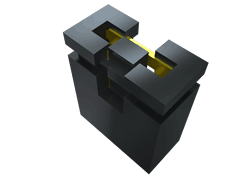

Bitstream Evolution Dev Board
===
###### Created by Logan Manthey ( [@manthelt](https://github.com/manthelt) )
---

## Introduction

This development board is an extension of the evolvable hardware opensource project (https://evolvablehardware.org/). It was created to expand and bring new features to the evolvable hardware ecosystem while still maintaining it’s accessibility. To make the board accessible KiCAD was chosen for the CAD software given it’s open source and free nature. To find Gerber files for printing take a look at the release section. 

## Features

* **Multi-Channel ADC** 
Supporting two 8 channel **NAME OF ADC** ADCs this dev board can record up to 16 channels at up to **XX** samples per second. External ADCs were choose as to free up ports on the nano which would allow for more interrupt input channels to use with experiments such as variance maximization. 

 * **Multi-Channel DAC**
To provide support for future expandability multi channel DACs were included. The primary use case of these DACs is for setting the reference voltage for the the interrupt input on the nano but can be used for other various purposes such as adjusting a voltage offset for the waveform or for setting the reference voltage for the ADCs 

* **Clock Generation**
This Dev Kit also includes a programmable clock generator. The primary uses of this are for both sanity checking instrumentation and for evolving more complex circuits which utilize a waveform as an input source. To allow for this expandability the waveform outputs were left as male jumper pins for easy connection to any section of the board. This will be especially useful when recreating a tone discriminator. There are also multiple channels which are able to be set through software. This allows for more complex experiments to take place which could involve multiple clocks.

## Getting Started and Usage
The following link will take you to the firmware for this project that is to be installed on the nano

### Connecting Channels
To provide the most amount of modulatary each one of the channels on the ADC and each one of connections on the Arduino has a 2 port male connection. By shorting these one can connect channels in varying configurations. The following is an overview of how this connection scheme is archived. 

As one can see both of the connections can be made at the same time. If this is the case and the Arduino is outputting digital outputs then those outputs will be seen on the ADC. 

_Example of Jumper that can be used to short connections (SNT-100-BK-T)_

### Clock Generation
After being set through software the clock generation allows for up to three channels to output a clock. One can simply use a jumper cable to connect to the required section of the board for the experiment at hand.

### DAC Usage
The DACS are also able to be set through software. There are multiple channels to be set as well. 

_Note: The RDY and LDAC outputs are for debugging purposes and made accessible but not highlighted to avoid confusion. To see what these do reference the DAC data sheet found in the data sheets folder_

## Design Methodology 

### Clock Generation
The Clock generation section also has male pin outs which allow for flexibility with the configuration. For example you can send in a output from the waveform into a certain input to the FPGA or even send it into the Arduino as an input to sanity check the input values. 

### ADC Section
Given the current platform uses digital serial as the main form of communication there is a temporary data store on the ardunio itself from the ADCs after initiating a data capture. After said capture is complete the data can then be relayed back to the evolution algorithm using the serial lines. Given only one of the channels can be recorded at any given time a decrease in samples per second will occur when capturing more than 1 channel at a given time. This decrease can be seen outlined below in the table. For future expandability a more parallel approach will be needed to increase the samples per second for each one of the channels.  

**A Channels**

|Channels Active|Samples Per Second|
|:-:|:-:|
|1|XXX|
|2|XXX|
|3|XXX|
|4|XXX|
|5|XXX|
|6|XXX|
|7|XXX|
|8|XXX|

  

**B Channels**

|Channels Active|Samples Per Second|
|:-:|:-:|
|1|XXX|
|2|XXX|
|3|XXX|
|4|XXX|
|5|XXX|
|6|XXX|
|7|XXX|
|8|XXX|

  

## BOM

|Reference                                                  |Quantity|Value                |Comment                                           |
|-----------------------------------------------------------|--------|---------------------|--------------------------------------------------|
|A1                                                         |1       |Arduino Nano Every   |                                                  |

### https://github.com/manthelt

Copyright &copy; 2023 [manthelt](https://github.com/manthelt)

